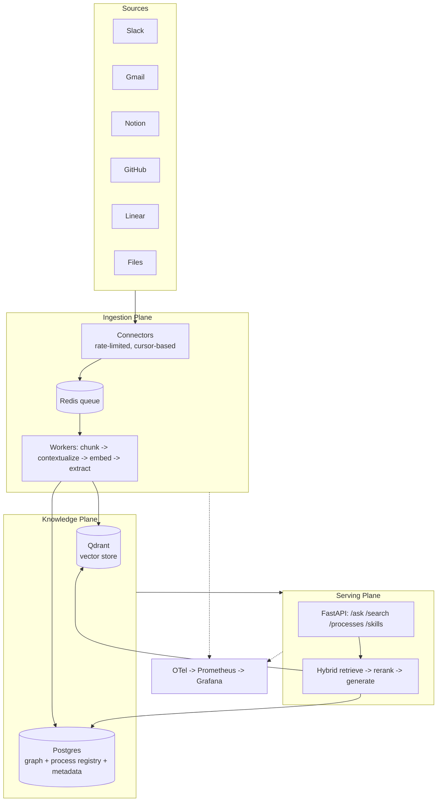
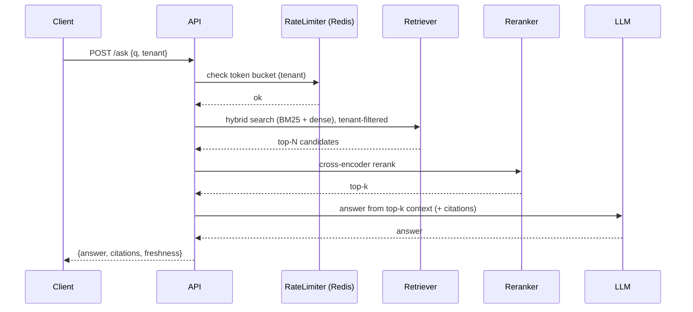

# Architecture — Cortex

**Status:** Draft v1

This document describes the system design: the three planes, components, data
flow, technology rationale, and how the system scales.

---

## 1. Design principles

1. **Structure over storage.** The product is structured knowledge (processes,
   entities, relations), not a pile of embeddings. Embeddings are a means.
2. **Everything is cited.** Every fact, answer, and process step links to a source
   artifact. No citation → not served.
3. **Stateless serving, stateful stores.** All horizontal scale lives in the
   serving plane; durable state lives in Qdrant / Postgres / Redis.
4. **Incremental by default.** Re-ingest only what changed. Extraction is the
   expensive step; never recompute the whole corpus.
5. **Tenant isolation is non-negotiable.** Enforced in storage and asserted in CI.

---

## 2. Three-plane overview

---

## 3. Ingestion plane

**Goal:** get raw artifacts from sources into structured knowledge, continuously,
idempotently, and within source rate limits.

### Components
- **Connectors** (`packages/connectors`): one adapter per source. Each implements
  a common interface: `backfill()`, `poll(cursor)`, `normalize(raw) -> Artifact`.
  Each connector owns a **per-source token bucket** and backoff.
- **Queue** (Redis + `arq`): ingestion jobs are enqueued per artifact-batch.
  Priority lanes: `realtime` (webhook deltas) > `backfill` > `reprocess`.
- **Workers**: pull jobs and run the pipeline:
  1. **Chunk** (source-aware — see `RETRIEVAL_AND_ML.md`).
  2. **Contextualize** (LLM blurb prepended per chunk — only on new/changed chunks).
  3. **Embed** (batched, fine-tuned BGE).
  4. **Extract** entities/relations + candidate process objects.
  5. **Upsert** into Qdrant (vectors) + Postgres (graph, processes, metadata).

### Idempotency
Every artifact has a stable `(source, external_id, content_hash)`. Re-ingest with
an unchanged hash is a no-op. Changed hash triggers re-chunk + re-extract of only
the affected artifact, and marks dependent process objects **stale**.

### Failure handling
Poison artifacts go to a dead-letter queue with the error and payload for replay.
Worker crashes are safe because jobs are at-least-once and the pipeline is idempotent.

---

## 4. Knowledge plane

The durable heart of the system. Three stores, one logical model
(see `DATA_MODEL.md`).

- **Qdrant** — chunk vectors + payload (tenant, source, artifact_id, timestamps,
  hash). Sharded by tenant; payload filters enforce tenant + source scoping.
- **Postgres** — three concerns:
  - **Graph**: `entities` + `relations` (edge list; queryable, versioned).
  - **Process registry**: versioned `process` objects + `process_step` + citations.
  - **Metadata**: artifacts, chunks, sync cursors, freshness/staleness state.
- **Redis** — ephemeral: queues, rate-limit buckets, semantic cache.

Why Postgres for the graph (not Neo4j) in v1: traversals are shallow (1–2 hops),
the relational engine handles the volume, and one fewer datastore keeps ops
simple. Revisit if traversal depth/volume grows (see Open Questions in PRD).

---

## 5. Serving plane

Stateless FastAPI services behind a load balancer. Horizontal scale = add pods.

### `/ask` request flow

- **Semantic cache**: identical/near-identical queries within a tenant hit a Redis
  cache keyed by embedding bucket → skip retrieval+LLM.
- **Skills export**: assembles current, non-stale process objects for a tenant into
  the agent-consumable file (see `API.md`).

---

## 6. Multi-tenancy & isolation

- **Vector**: tenant = Qdrant shard key + mandatory payload filter. A query without
  a tenant filter is rejected at the retrieval layer.
- **Relational**: every table carries `tenant_id`; row-level security policy +
  app-layer guard.
- **Tests**: a CI test seeds two tenants, queries across them, and asserts zero
  cross-tenant results. Failing this fails the build.

---

## 7. Rate limiting

Two independent layers (detail in `API.md` / `INGESTION.md`):
- **Egress (ingestion):** per-source token buckets so connectors never exceed a
  source's API quota; exponential backoff + jitter on 429s.
- **Ingress (serving):** per-tenant token buckets on `/ask`, `/search`, `/skills`,
  with separate read vs. heavy-op (LLM) quotas. Returns `429` + `Retry-After`.

Both implemented as Redis token buckets (atomic Lua script) for correctness under
concurrency.

---

## 8. Scaling strategy

| Bottleneck | Strategy |
|-----------|----------|
| Ingestion throughput | Add workers; partition queue by source; batch embeddings |
| Embedding compute | Batch + GPU; compute only on changed chunks |
| LLM extraction cost | Incremental (changed chunks only); batch; cache blurbs |
| Vector search latency | Qdrant shards by tenant; HNSW params tuned per recall SLO |
| Serving QPS | Stateless API pods autoscaled on CPU + queue depth |
| Hot retrieval path | (Level-up) BM25 + RRF fusion in Rust via PyO3 or sidecar |

**Load-test target:** sustain 600 QPS on `/search` at p95 < 200 ms over a
2M-chunk index; report p50/p95/p99 and throughput in `scripts/load_test.py` output.

---

## 9. Observability

- **Tracing:** OpenTelemetry spans across API → retrieve → rerank → LLM, and across
  connector → worker → store. One trace id per ingest job and per request.
- **Metrics (Prometheus):** request latency histograms, QPS, 429 rate, queue depth,
  ingestion throughput, embedding/extraction durations, cache hit rate, **retrieval
  quality metrics from the eval harness**.
- **Dashboards (Grafana):** Serving SLOs, Ingestion health, Knowledge growth,
  Eval trends over time.

---

## 10. Deployment

- **Local:** `docker-compose` (postgres, qdrant, redis, otel collector, grafana).
- **Cloud:** Terraform provisions managed Postgres, a Qdrant cluster, Redis, and a
  k8s cluster. API + workers ship as separate Deployments; HPA on each.
- **CI/CD:** lint → unit → integration → **eval regression gate** → image build →
  deploy. A retrieval-quality regression below threshold blocks the pipeline.
