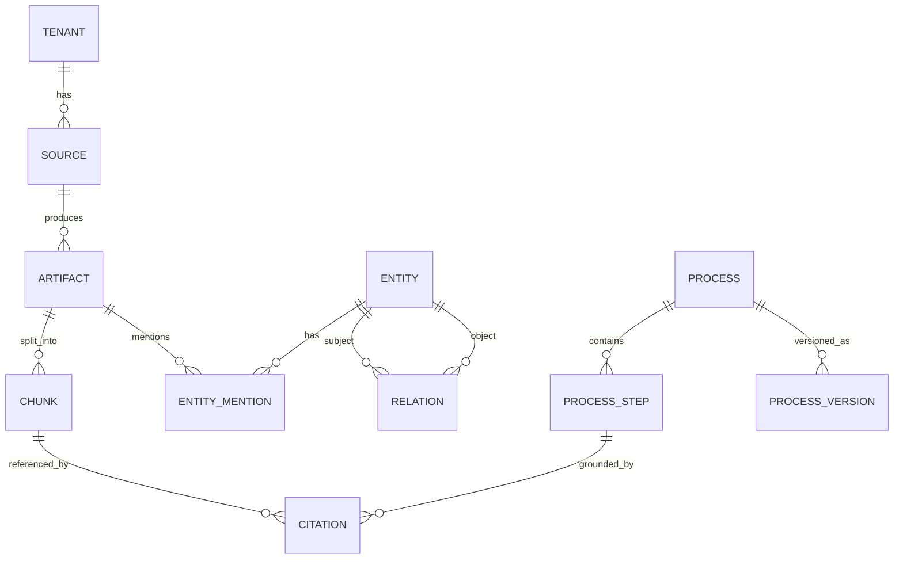

# Data Model — Cortex

**Status:** Draft v1

Cortex has one logical knowledge model spread across three stores. This document
defines the schemas: relational/metadata + graph (Postgres), the vector payload
(Qdrant), and the **process object** (the product's core unit).

---

## 1. Entity overview



---

## 2. Relational + metadata (Postgres)

All tables carry `tenant_id uuid not null` with row-level security.

### `sources`
| col | type | notes |
|-----|------|-------|
| id | uuid PK | |
| tenant_id | uuid | |
| kind | text | `slack` `gmail` `notion` `github` `linear` `file` |
| config | jsonb | scopes, workspace ids |
| cursor | jsonb | incremental sync state |
| status | text | `connected` `syncing` `error` |

### `artifacts`
| col | type | notes |
|-----|------|-------|
| id | uuid PK | |
| tenant_id | uuid | |
| source_id | uuid FK | |
| external_id | text | id in source system |
| content_hash | text | idempotency key |
| kind | text | `message` `email` `page` `pr` `issue` `doc` |
| raw_ref | text | object-store pointer to normalized raw |
| created_at / updated_at | timestamptz | |
| UNIQUE | (tenant_id, source_id, external_id) | |

### `chunks`
| col | type | notes |
|-----|------|-------|
| id | uuid PK | |
| tenant_id | uuid | |
| artifact_id | uuid FK | |
| ordinal | int | position in artifact |
| text | text | chunk body |
| context_blurb | text | LLM-generated contextual prefix |
| token_count | int | |
| vector_id | uuid | id of vector in Qdrant |
| content_hash | text | re-embed only on change |

### `freshness`
| col | type | notes |
|-----|------|-------|
| object_type | text | `chunk` `process` `entity` |
| object_id | uuid | |
| state | text | `fresh` `stale` `expired` |
| last_validated_at | timestamptz | |
| ttl_seconds | int | per type policy |

---

## 3. Knowledge graph (Postgres edge list)

### `entities`
| col | type | notes |
|-----|------|-------|
| id | uuid PK | |
| tenant_id | uuid | |
| type | text | `person` `team` `system` `policy` `product` `customer` ... |
| name | text | canonical name |
| aliases | text[] | resolved surface forms |
| attributes | jsonb | type-specific |

### `entity_mentions`
Links an entity to the artifact/chunk it was observed in (provenance).
| col | type |
|-----|------|
| entity_id | uuid FK |
| chunk_id | uuid FK |
| span | int4range |
| confidence | real |

### `relations`
| col | type | notes |
|-----|------|-------|
| id | uuid PK | |
| tenant_id | uuid | |
| subject_id | uuid FK -> entities | |
| predicate | text | `approves` `owns` `escalates_to` `reports_to` ... |
| object_id | uuid FK -> entities | |
| confidence | real | |
| source_chunk_id | uuid FK | provenance |
| valid_from / valid_to | timestamptz | temporal validity |

Temporal columns let the graph answer "who approved refunds *last quarter*" and
support contradiction detection (two `approves` edges with overlapping validity →
flag).

---

## 4. Vector payload (Qdrant)

One point per chunk. Vector = embedding of `context_blurb + text`.

```json
{
  "id": "<vector_id>",
  "vector": [ ... 384 floats (bge-small) ... ],
  "payload": {
    "tenant_id": "uuid",         // shard key + mandatory filter
    "source_kind": "slack",
    "artifact_id": "uuid",
    "chunk_id": "uuid",
    "kind": "message",
    "created_at": 1736400000,
    "content_hash": "sha256:...",
    "freshness": "fresh"
  }
}
```

- **Sharding:** by `tenant_id`.
- **Filtering:** every query MUST include `tenant_id`; optional `source_kind`,
  `freshness != expired`, time-range on `created_at`.
- **Index:** HNSW; `m` / `ef_construct` / `ef_search` tuned to the Recall@10 SLO
  (see `RETRIEVAL_AND_ML.md`).

---

## 5. Process object — the core unit

A **process** is a validated, versioned, source-cited description of how a
recurring task is done. This is what gets exported to agents.

### `processes`
| col | type | notes |
|-----|------|-------|
| id | uuid PK | |
| tenant_id | uuid | |
| name | text | "Refund over $500" |
| trigger | text | when this process applies |
| current_version | int | |
| status | text | `draft` `active` `stale` `deprecated` |
| confidence | real | extraction confidence |

### `process_versions`
| col | type | notes |
|-----|------|-------|
| id | uuid PK | |
| process_id | uuid FK | |
| version | int | |
| body | jsonb | full structured process (below) |
| created_at | timestamptz | |
| created_by | text | `extractor` or human reviewer |

### `process_step`
| col | type | notes |
|-----|------|-------|
| id | uuid PK | |
| process_version_id | uuid FK | |
| ordinal | int | |
| action | text | imperative step |
| actor_entity_id | uuid FK nullable | who performs it |
| decision | jsonb nullable | branch conditions |

### `citations`
| col | type | notes |
|-----|------|-------|
| owner_type | text | `process_step` `answer` `relation` |
| owner_id | uuid | |
| chunk_id | uuid FK | exact source |
| quote_span | int4range | span within chunk |

### Canonical process JSON (the `body`)

```json
{
  "name": "Refund over $500",
  "trigger": "Customer requests a refund exceeding $500 USD",
  "actors": ["support_agent", "finance_approver"],
  "steps": [
    {
      "ordinal": 1,
      "action": "Support agent verifies order and refund eligibility",
      "actor": "support_agent",
      "citations": ["chunk:uuid-a"]
    },
    {
      "ordinal": 2,
      "action": "If amount > $500, route to finance for approval",
      "actor": "support_agent",
      "decision": { "if": "amount_usd > 500", "then": 3, "else": 5 },
      "citations": ["chunk:uuid-b"]
    },
    {
      "ordinal": 3,
      "action": "Finance approver reviews and approves or denies",
      "actor": "finance_approver",
      "citations": ["chunk:uuid-c"]
    }
  ],
  "freshness": { "state": "fresh", "last_validated_at": "2026-06-09T00:00:00Z" },
  "version": 4
}
```

**Invariant:** every step must carry ≥1 citation. A step without a citation is
rejected at validation time (Pydantic). This is the structural guard against
hallucinated processes.

---

## 6. Skills file (export format)

The agent-consumable artifact assembled from active, non-stale process objects for
a tenant/scope. See `API.md` §`/skills` for the wire format. It is a flattened,
agent-readable projection of the process objects with inline citations and a
freshness manifest, so an external agent runtime can ground its actions and know
how current each instruction is.
