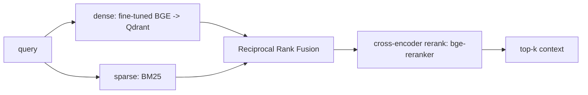

# Retrieval & ML — Cortex

**Status:** Draft v1

This is the depth document: chunking, embeddings (incl. fine-tuning), hybrid
retrieval + reranking, knowledge/process extraction, and the evaluation harness
with its CI regression gate. These are the pieces that prove ML depth, not just
plumbing.

---

## 1. Chunking (source-aware)

Fixed-size chunking is a baseline only. Each source type chunks differently:

| Source | Chunk unit | Rationale |
|--------|-----------|-----------|
| Slack | Thread, or sliding window of N turns within a thread | A thread is one semantic unit; turns lose context alone |
| Email | Message, with quoted history stripped | Quoted replies cause near-duplicate noise |
| Notion / docs | Heading-delimited section, recursive split if too long | Respect author's structure |
| GitHub PR | PR description + grouped review comments; code by hunk | Discussion and code have different semantics |
| Linear / issues | Issue body + comment cluster | |
| Files | Recursive semantic split (markdown/headings → paragraphs) | |

**Contextual retrieval.** Before embedding, prepend a short LLM-generated blurb
situating the chunk in its artifact ("This is from the #billing channel, a thread
about refund policy exceptions..."). Embed `blurb + text`. This materially lifts
retrieval on short, context-poor chunks (e.g. single Slack messages). Blurbs are
computed once and only recomputed when the chunk's `content_hash` changes.

Benchmark **late chunking** as an alternative and record which wins per source in
the eval report.

---

## 2. Embeddings

- **Base model:** `bge-small-en-v1.5` (384-d) — strong quality/latency tradeoff,
  cheap to fine-tune. Swap to `bge-base` if eval justifies the latency cost.
- **Fine-tuning (the ML-depth centerpiece):**
  - **Objective:** `MultipleNegativesRankingLoss` (in-batch negatives) on
    `(query, positive_chunk)` pairs plus mined **hard negatives**.
  - **Hard-negative mining:** run the base retriever over the golden queries, take
    high-scoring chunks that are *not* labeled relevant as hard negatives. Cap per
    query; refresh each training round.
  - **Training data:** golden `(query → relevant chunk)` pairs (see §5) augmented
    with synthetic queries generated from chunks (LLM), filtered by round-trip
    consistency.
  - **Acceptance:** the fine-tuned model must beat base `bge-small` by **≥ 5%
    Recall@10** and **≥ 0.03 nDCG@10** on the held-out golden set, or it is not
    shipped.
- **Serving:** embeddings batched; GPU if available, ONNX/quantized on CPU otherwise.

`scripts/train_embeddings.py` runs mine → train → eval → emit a comparison report
against the baseline.

---

## 3. Hybrid retrieval + reranking

- **Dense:** ANN over Qdrant (tenant-filtered).
- **Sparse:** BM25 (Postgres FTS or a dedicated index) for exact-term/rare-token
  recall (IDs, error codes, names) that dense misses.
- **Fusion:** Reciprocal Rank Fusion over the two lists (no score calibration
  needed; robust). Record per-source weights if learned fusion is tried.
- **Rerank:** cross-encoder over the top-N fused candidates → top-k. This is the
  single biggest precision lever.
- **Level-up:** implement BM25 + RRF in Rust (PyO3) for a measured hot-path latency
  drop; report before/after.

---

## 4. Knowledge & process extraction

### 4.1 Entity + relation extraction
- LLM structured extraction per artifact → candidate `(entity, type)` and
  `(subject, predicate, object)` triples, each with a source span.
- **Entity resolution:** canonicalize aliases via embedding similarity + rules;
  merge into existing `entities`.
- Confidence-thresholded; low-confidence goes to a review queue, not the graph.

### 4.2 Process extraction (the product core)
- **Detection:** cluster artifacts/chunks that describe a recurring task (e.g.
  refund handling appears across Slack + Notion + tickets). Clustering over chunk
  embeddings + entity overlap.
- **Synthesis:** LLM assembles a candidate process object from the cluster, in the
  canonical JSON schema (`DATA_MODEL.md` §5), **with a citation per step**.
- **Validation (Pydantic):** schema-valid, every step cited, actors resolve to
  known entities. Failing any → rejected.
- **Faithfulness gate:** an NLI / LLM-judge check that each step is entailed by its
  cited chunk(s). Steps that fail are dropped or flagged for review.
- **Versioning + contradiction:** if a new extraction conflicts with an active
  process, create a new version and flag the diff for review rather than silently
  overwriting.

---

## 5. Evaluation harness (with CI gate)

The eval harness is the strongest reliability signal in the project. It runs
offline and in CI.

### 5.1 Golden datasets
- **Retrieval golden:** `query → relevant chunk_ids`. Built from seeded corpora +
  human labels. Held-out test split never used in training.
- **Generation golden:** `query → reference answer` + the chunks that should ground it.
- **Process golden:** hand-authored canonical processes for the seed corpus.

### 5.2 Metrics
| Layer | Metrics |
|-------|---------|
| Retrieval | Recall@k, nDCG@k, MRR (k ∈ {5,10,20}) |
| Generation | Faithfulness/groundedness, context precision, context recall, answer relevance (RAGAS-style; LLM-judge calibrated to human labels) |
| Process extraction | Step precision/recall vs golden, actor-resolution accuracy, citation validity rate |
| Embedding A/B | Fine-tuned vs base: ΔRecall@10, ΔnDCG@10 |

### 5.3 LLM-judge calibration
Don't trust the judge blindly. Calibrate the judge against a human-labeled subset;
report judge↔human agreement (Cohen's κ). If agreement is low, the judge metric is
advisory only.

### 5.4 CI regression gate
On every PR, run the eval suite on the seed corpus. Fail the build if:
- Recall@10 drops below **0.85**, or
- nDCG@10 drops below **0.70**, or
- faithfulness drops below **4.0/5.0**, or
- process citation-validity rate drops below **0.95**.

This makes retrieval/extraction quality a first-class, regression-protected
property — the thing most resume RAG projects never do.

### 5.5 Reporting
`packages/eval` emits a markdown + JSON report per run (metrics, deltas vs. last
run, per-source breakdown) and pushes the headline metrics to Prometheus so Grafana
tracks quality over time.
