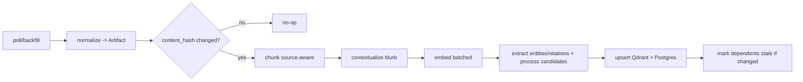
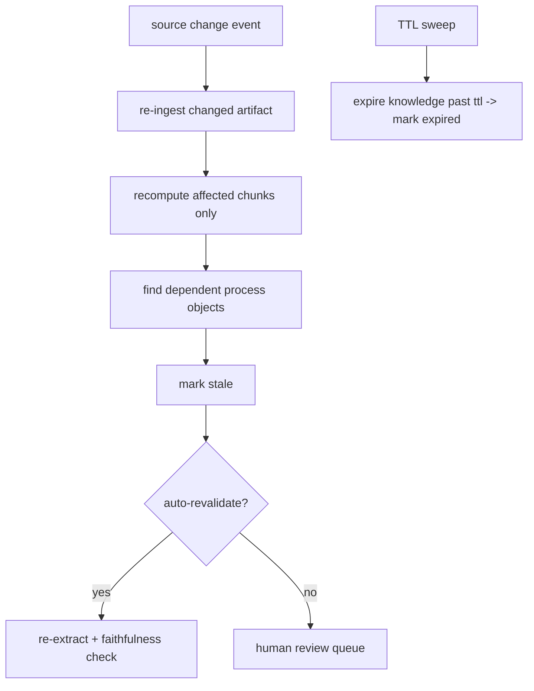

# Ingestion — Cortex

**Status:** Draft v1

How raw artifacts get from sources into structured knowledge: the connector
contract, the async pipeline, idempotency, rate limiting, and the freshness loop.

---

## 1. Connector contract

Every source adapter (`packages/connectors/<kind>`) implements:

```python
class Connector(Protocol):
    kind: str
    def backfill(self, cfg: SourceConfig) -> Iterator[RawItem]: ...
    def poll(self, cfg: SourceConfig, cursor: Cursor) -> tuple[Iterator[RawItem], Cursor]: ...
    def normalize(self, raw: RawItem) -> Artifact: ...      # -> canonical Artifact
    rate_limit: TokenBucketSpec                              # per-source quota
```

- **`backfill`** — one-time full history pull on first connect (paginated).
- **`poll`** — incremental delta since `cursor`; returns new cursor. Driven by
  webhooks where the source supports them, by interval polling otherwise.
- **`normalize`** — map source payload to the canonical `Artifact`
  (`source_kind`, `external_id`, `kind`, `content`, `created_at`, participants).

### v1 connectors
Slack, Gmail, Notion, GitHub, Linear, generic file upload. A `sample` connector
seeds a deterministic synthetic corpus for tests and the eval golden set.

---

## 2. Pipeline



Each stage is a unit-testable function. The worker (`apps/workers`, `arq`)
orchestrates them per job: `run_pipeline` (`cortex.workers.pipeline`) is the arq
task, and the API enqueues it via `enqueue_ingest_event` when `CORTEX_WORKER_ASYNC`
is set (else it runs inline). Jobs route to priority lanes — `realtime` (webhook
deltas) > `backfill` (history pulls, via `enqueue_backfill` / `ingest --enqueue`) >
`reprocess` (DLQ replays); run one worker per lane (`CORTEX_WORKER_QUEUE`) and give
realtime the most concurrency so backfills never starve live updates. A job that
still fails after `MAX_TRIES` (with backoff) is dead-lettered to a Redis list
(`cortex.workers.deadletter`) for inspection/replay rather than lost. Concurrent
backfill jobs racing to create the same shared source/entity are made safe by unique
constraints plus retry (the rolled-back txn finds the row on the next attempt).
Embeddings and LLM extraction are **batched** across a job's chunks to amortize cost.

---

## 3. Idempotency

- Artifact identity: `(tenant_id, source_id, external_id)`.
- Change detection: `content_hash` (sha256 of normalized content).
- Re-ingesting an unchanged artifact is a no-op (hash match → skip).
- A changed artifact re-runs the pipeline for *that artifact only* and marks
  dependent chunks/processes stale.
- All upserts are `ON CONFLICT` / Qdrant `upsert` — at-least-once delivery is safe.

---

## 4. Rate limiting (egress / source-side)

Connectors must never exceed a source's API quota.

- **Per-source token bucket** (Redis, atomic Lua) sized to each source's documented
  rate limit, with headroom.
- **Backoff:** exponential + jitter on HTTP 429 / `Retry-After`; the offending job
  is requeued, not dropped.
- **Priority lanes:** `realtime` (webhook deltas) preempt `backfill`, which preempts
  `reprocess`. Backfills of large workspaces never starve live updates.
- **Concurrency caps** per source so one tenant's big backfill can't monopolize a
  shared connector.

---

## 5. Freshness loop

The "keeps it current" requirement — what separates a brain from a one-time dump.



- **Change-driven:** webhook/poll delta → re-ingest → recompute only affected
  chunks → mark dependent process objects **stale**.
- **TTL sweep:** a periodic job marks knowledge older than its type's TTL
  `expired`. Expired knowledge is filtered out of retrieval by default.
- **Contradiction detection:** when re-extraction yields a process/relation that
  conflicts with an active one (e.g. a different approver, overlapping temporal
  validity), create a new version and flag the diff — never silently overwrite.
- **Serving guarantee:** stale/expired knowledge is never served as current. `/ask`
  and `/skills` return a freshness state per answer/step.

---

## 6. Throughput & backpressure

- **Target:** ≥ 500 docs/min/worker sustained; scale by adding workers.
- **Backpressure:** queue depth is a Prometheus metric and an autoscaling signal;
  if extraction lags, low-priority `reprocess` jobs are shed first.
- **Dead-letter:** poison artifacts (parse failures, repeated extraction errors) go
  to a DLQ with payload + error for inspection and replay.

---

## 7. Observability

Per-job trace id spans connector → normalize → pipeline → upsert. Metrics: docs/min,
per-stage duration, queue depth per lane, 429 rate per source, DLQ size, stale/expired
counts. All surfaced on the Grafana "Ingestion health" dashboard.
